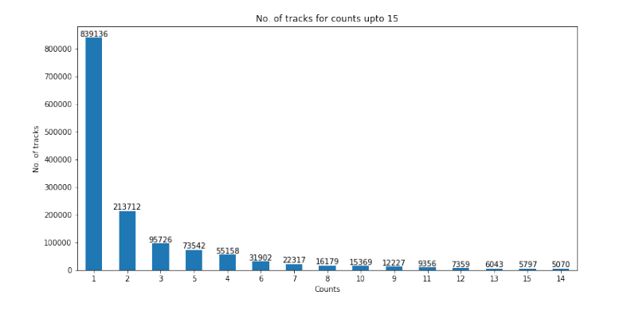

# PySpark-Song-Recommendation-System

## Overview
Building recommendation systems (RS) using implicit feedback is a challenging task. Most of the literature on recommendation systems is mainly focused on modelling explicit feedback because of its convenient interpretation and the availability of well-defined evaluation metrics, such as RMSE, to gauge test-set performance. Nevertheless, certain ways are indeed available to extract confidence from implicit data and here we present and implement some of these methods to develop a RS using collaborative filtering for recommending songs to users based on the number of times (counts) a user listened to a particular song. so here we build and evaluate such a recommender system using PySpark and Hadoop.

The distribution of the counts or the number of times users listened to songs in the training dataset is as follows - 

## Basic recommender system

The basic recommendation model uses Spark's alternating least squares (ALS) method to learn latent factor representations for users and songs. The following hyper-parameters were tuned for the model for optimizing performance on the validation set:

  - the *rank* (dimension) of the latent factors,
  - the *regularization* parameter, and
  - *alpha*, the scaling parameter for handling implicit feedback (count) data.

The choice of evaluation criteria for hyper-parameter tuning was chosen to be Mean average precision (MAP). Evaluations are based on predictions of the top 500 items for each user. The baseline results are shown below - 

|RegParam |  Rank | Alpha | MAP Val set |
|----------|-------|-------|-------------|
|0.01 | 50 | 40 |0.043984 |
|0.01 | 100 | 40 |0.050432  |
|0.1 | 20 | 40 | 0.034757  |
|0.1  | 50 | 100 | 0.042809 |
|0.1 | 100 | 40  |0.051215 |
|1 | 20 | 20 | 0 | 036101 |
|1 | 50 | 40 | 0.046382  |
|1 | 100 | 40 | 0.054679 |
|10 | 20 | 40 | 0.033212 |
|10 | 50 | 100,0.049238 |
|10 | 100 | 40 | 0.054916 |

## Extensions

An extension on top of the baseline collaborative filtering model was applied that focused on *Alternative model formualtions*. The `AlternatingLeastSquares` model in Spark implements a particular form of implicit-feedback modeling, but we changed its behavior by modifying the count data for the training set and calculated the corresponding MAP values on the validation set for all the different modifications like using log compression with base 2, squaring the counts, dropping low counts etc. To fit the model, we used only the best set of parameter values obtained previously and did not perform any hyperparameter tuning for evaluating these extension models due to resource limitations. Some results are shown below - 

| Modification | MAP val |
|--------------|---------|
| Log compression base e | 0.059706 |
| Log compression base 2 | 0.062177 |
| Square count | 0.040991|
| Cube count | 0.024946 |
| Drop count 1 | 0.040312 |
| Drop count <= 2| 0.032698 |
| Drop count <=3 | 0.027348 |
| Drop count <=4 | 0.023669 |
| Drop count <=5 | 0.021249 |
| Binning |  0.050674  |
